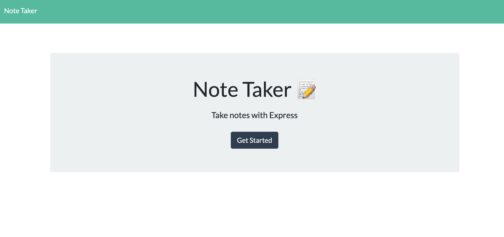
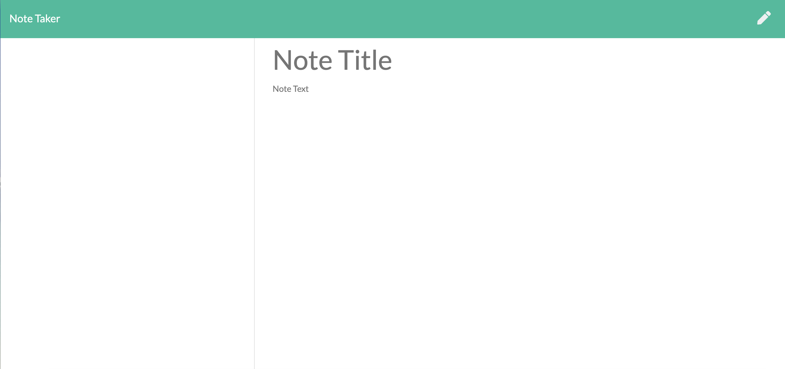

<h2>Unit 11 Express Homework: Note Taker</h2>

The purpose of this homework was to create an application that can be used to write, save, and delete notes. 

<h3>Code Style</h3>

<ul>
  <li>HTML</li>
  <li>CSS</li>
  <li>JavaScript</li>
  <li>Expresss.js</li>
  <li>
</ul>

<h3>Prerequisites</h3>

<ul>
  <li>Visual Studio Code</li>
  <li>GitHub Account</li>
  <li>NPM Inquirer Package</li>
  <li>Heroku Account</li>
</ul>

<h3>Note Taker Criteria</h3>

<li>As a user, I want ot be able to write and save notes, and then be able to delete said notes</li>

